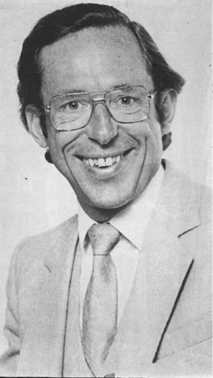
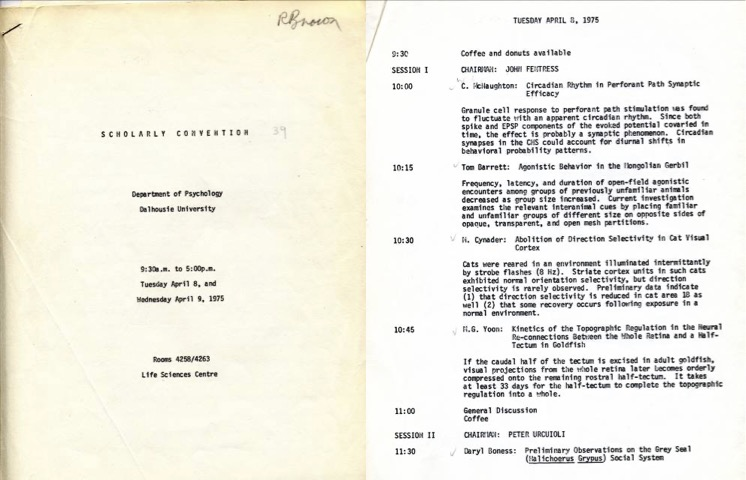
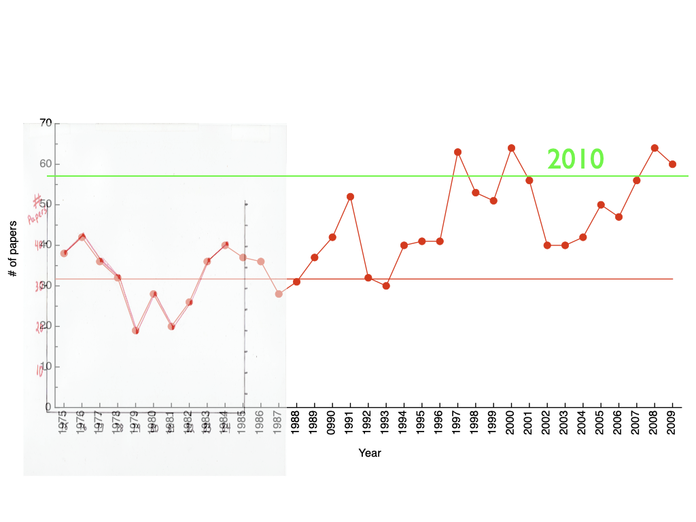
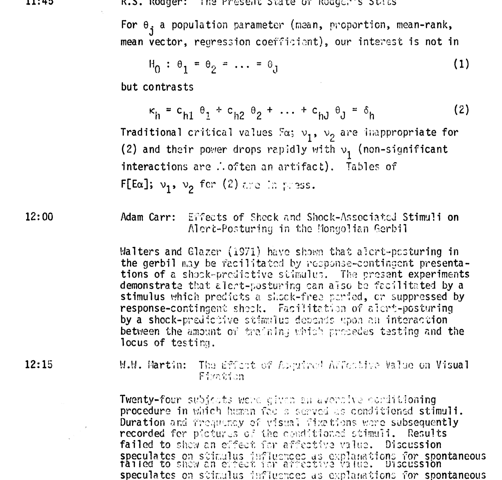

<!-- _class: title -->
<!-- _backgroundColor: "#FFD400" -->
<!-- _color: "#000" -->
<!-- _paginate: false -->

# 50 Years of In-House

## A computational love-letter to our conference

Aaron J. Newman · 50th Annual Graham Goddard In-House Conference · 2026

---

# Graham Goddard (1938–1987)

- Dalhousie psychologist + neuroscientist
- Discovered the **kindling model** of epilepsy (Goddard, 1967)
- Built the early Dalhousie animal-learning + neurophysiology group
- Founded what we now call the **In-House Conference**

In 2011, **24 years after his death**, the conference was renamed in his honour. Everything that follows is, in a real sense, his department.

---

# Where it began — April 1975

The very first In-House: Tuesday April 8 – Wednesday April 9, 1975. **Coffee and donuts at 9:30**, chair: **John Fentress**.

The first ever abstract:
> *C. McNaughton — "Circadian Rhythm in Perforant Path Synaptic Efficacy"*

Note the handwritten *"R. Brown"* in the top corner. **That's the same copy still living in his filing cabinet 51 years later.**

---

# Why are we doing this?

We have **50 conference programs** sitting in a OneDrive folder.

Half a century of:

- thousands of presentations
- generations of trainees
- decades of departmental memory

…and absolutely **zero ability to search any of it.**

> Goal: turn paper, scanned PDFs, and Word documents into a **structured, queryable, archival record** of who did what — and when.

---

# What we want at the end

- A canonical **BibTeX** archive of every presentation, 1975–2026
- A **GitHub repository** with the pipeline + the data
- A **GitHub Pages site** to search, browse, and visualise the corpus
- A long-term deposit in **Dalhousie's Borealis** research-data repository

The corpus then becomes a substrate for:
*authorship networks · topic trends · trainee genealogies · a half-century zeitgeist of the Department*

---

# Acknowledgements (before we go any further)

The programs do not exist as a set. They were **rescued** by:

- **Richard Brown** — the principal hoarder-historian, custodian of decades of paper programs
- **Suzanne King** — gap-filling from her own archive
- **Susan Lowerison** — additional gap-filling and document recovery

A genuine **community archaeology** effort. Without their filing cabinets, none of this exists.

---

# Prior art (we are not the first)

Ray Klein, ~2010 — a hand-drawn plot of **# papers / year** through the first 35 years.

The dotted region pre-1988 was the **paper-only era**; the rest was scraped from emerging electronic programs.

*Tonight: the same idea, with 16 extra years of data and a few thousand presentations more.*

---

# The source material is… **a mess**

| Decade | Format |
|---|---|
| 1975 | typewritten, photocopied, scanned, OCR'd through tears |
| 1976–2001 | scanned PDFs of typewritten or word-processed pages |
| 2002 | original PDF unreadable; only pre-OCR'd `.txt` survives |
| 2003–2013 | `.doc` files (some of which Word itself refuses to open) |
| 2014–2026 | mostly PDF, a stray `.docx` and `.rtf` |

50 years of file formats. The OCR for **1975** alone produced gems like:

> *"Mus l<usicus."* — J. C. Fentress, 1977
> *"f:lart·;n, H.L"* — somebody named Martin, probably

---

# The OCR's worst day (and a personal favourite)

Rodger's **"The Present State of Rodger's Stats"** (1975) — an abstract written almost entirely in **formulae**. Tesseract, gamely:

> *"H0 : θ1 = θ2 = … = θj"*

…sometimes became *"H'O : 0'1 = 02 = ... = OJ"*.

You can also see the OCR engine **duplicating the last paragraph** at the bottom — a recurring failure mode that drove three rounds of cleanup logic.

---

# Method 1 — Extract

`pipeline/01_extract.py`

- **PDFs** → `pdftotext` (with a custom OCR pass for the 1975–1979 rescans done in May 2026)
- **.doc** → `textutil` (macOS)
- **.docx** → unzip + parse XML
- **.rtf / .txt** → as-is, lightly normalised

Output: one `extracted/YYYY.txt` per year. Reproducible from source. **Throw it away and rebuild any time.**

---

# Method 2 — Parse (this is where the AI comes in)

Each year was a **different format**:

> *Talk #5)* vs *T5.* vs *T5:* vs *5. Author Name* vs `Lastname, Firstname` vs *A-3 (this year!)* vs *asterisk-delimited submission forms*…

The 51-year programmatic record has **fifteen distinct parser dialects.**

So we built one parser per format and a year→dialect dispatch table.

The parser was **co-developed iteratively with Claude.ai**:
*human spots a weird entry → Claude proposes a regex / heuristic → human runs it → human spots the next weird entry → repeat.*

---

# Method 3 — Cleanup with a human-in-the-loop

**Four rounds** of review + automated correction passes:

- `04_diagnose.py` — flags suspicious entries (too-long titles, missing authors, OCR garble)
- `05_review.py` — produces a `review_needed.bib` subset to edit by hand
- `06_diff_review.py` — diffs the human-edited bib back into machine-readable patches
- `07_split_entries.py` — splits "two-entries-glued-together-by-OCR" records using reviewer breakpoints

**Hand-edits never touch `records.jsonl`.** They live in `corrections.jsonl`, a sidecar of JSON ops that the exporter re-applies on every rebuild.

→ Fully reproducible. Re-run the whole thing in ~30 seconds.

---

# The corpus, by the numbers

- **2,155** presentations
- **50** conferences (1975–2026, no 2020/21)
- **2,117** unique-ish author keys
- **~98%** have an abstract
- **~220** still flagged for review (10%)

Cleanest cuts of the data:
- **1976–2018** — parser reliable, abstracts intact
- **2008–2026** — nearly perfect; great for text mining
- **1975, 2019, 2023** — flagged as lower-confidence

> Everything that follows comes from automated analysis of this corpus.
> Errors are mine; OCR's; or, occasionally, Claude's.

---

# The conference has had **five names**

| Years | Name |
|---|---|
| **1975** | *Scholarly Convention, Department of Psychology* |
| **1976–2002** | *N-th Annual In-House Convention, Department of Psychology* |
| **2003–2005** | *Annual Psychology and Neuroscience In-House Convention* |
| **2006–2010** | *Annual Psychology and Neuroscience In-House **Conference*** |
| **2011–present** | *Annual **Graham Goddard** In-House Conference* |

The 1983 program proudly announces itself as the *Eighth Annual*. It is, in fact, the **Ninth**. This has been bothering somebody for 43 years.

---

# Presentations per year

Dotted lines mark 2020 and 2021 (no conference, COVID). The conference counter <em>paused</em> rather than skipped — so 2022 is the 46th, not the 47th. 2026 is the 50th.

---

# Hall of Fame — top 25 contributors

---

# Top presenter, each year

Each dot is the person with the most entries that year. Colour = identity (so streaks pop). Bubble size = count.

---

# Streaks

Each row is a person; dots are years they presented; bar spans first–to–last appearance. Streak = longest run of <em>consecutive</em> conferences. (2020 and 2021 are treated as not-held, so the streak survives the COVID gap.)

---

# Co-authorship network

Nodes: authors with ≥6 presentations. Edges: co-authored ≥2 times. Layout: force-directed (Fruchterman–Reingold), seeded for reproducibility.

---

# Title extremes — the **shortest**

1978<strong>"Induced Anisocoria"</strong>
— J. Gardner

1980<strong>"Dropped Ducks"</strong>
— L. White & J. Ryon

1980<strong>"Selective Associations"</strong>
— K. Shapiro

1983<strong>"Semantic Priming"</strong>
— L. Smith & R. Klein

(Two whole words. That's the entire title. Imagine being on that abstract committee.)

---

# Title extremes — the **longest**

1980"Evidence to Support Crow's Reinforcement Hypothesis that Biologically Significant Behavior is Associated with Activity of the Locus Coeruleus and that the Consequent Release of Noradrenaline throughout the Forebrain has the Effect of Strengthening the Efficacy of Recently Active Synapses"
— G. V. Goddard, T. V. P. Bliss, H. A. Robertson, R. S. Sutherland (40 words)

2015"Is there a pharmacological intervention to replace darkness? Preliminary results from a collaborative study (M.I.T) of the use of intraocular injection of tetrodotoxin (TTX) to recover vision in animal models of amblyopia"
— D. Mitchell, K. Duffy, P. Northrup, M. Fong, M. Bear (34 words)

Goddard's 1980 title is, somehow, the abstract.

---

# Titles that should be on a T-shirt

2005<strong>"Doing the Locomotion With the Rat Perifornical Hypothalamus: Who's Excited About Glutamate?"</strong>

2007<strong>"Sex, Drugs, and Abrupt-Onset Distractors: Made You Look!"</strong>

2007<strong>"Stress Responding and Adolescent Development in a Rat Model System: Alley Cats and Hood Rats"</strong>
(2008 added: <em>"Alley Cats and Hood Rats, Part II"</em>)

2008<strong>"Energy Drinks: What Have You Binge Drinking??"</strong>

---

# Titles that should be on a T-shirt (2)

2008<strong>"Exhibitionist Flasher Uses Wing Mirrors with Fluorescent Fusilli for Sexual Entrapment"</strong>

2012<strong>"Sex on the Brain: Do Gender and Breeding Condition Affect FoxP2 Expression in Chickadees?"</strong>

2012<strong>"What Are We Really Measuring in Tests of Anxiety in Mice?"</strong>
(an entire literature distilled to nine words)

1977<strong>"Mus Musicus."</strong>
— J.C. Fentress. The whole thing is an extended joke about whether motor patterns have notes, rests, and melodies. Magnificent.

---

# Word of the year — the Department's shifting attention

**1977** — *seen*
**1978** — *mixed-motive*
**1979** — *tectal*
**1985** — *kindling*
**1991** — *kindling*
**1997** — *attention*
**2003** — *attention*

**2009** — *HPA-axis*
**2011** — *Alzheimer's*
**2013** — *Alzheimer's*
**2018** — *undergrad*
**2019** — *replication*
**2024** — *trauma*
**2025** — *settler*

Each year's most over-represented title word vs. the 50-year baseline. The Department's preoccupations, written by no one and edited by no one.

---

# What's next

- **GitHub repo** (`inhouse-conference-archive`): pipeline, data, corrections, this talk
- **GitHub Pages**: searchable web UI + interactive visualisations (co-authorship network you can pan around, year-by-year browser, full-text search)
- **Dalhousie Borealis** deposit: permanent, citable DOI for the dataset
- **Further cleanup**: the ~220 flagged entries, author canonicalisation, affiliation extraction
- **Linkage**: PubMed/Scholar lookup to find the *published* versions of these presentations

If you presented something between 1975 and 2026 and you find your name garbled, **come find me afterwards.**

---

<!-- _class: title -->
<!-- _backgroundColor: "#FFD400" -->
<!-- _color: "#000" -->
<!-- _paginate: false -->

# Thank you

## Richard Brown · Suzanne King · Susan Lowerison
## …and 50 years of presenters

aaron.newman@dal.ca · github.com/aaronjnewman (forthcoming)
